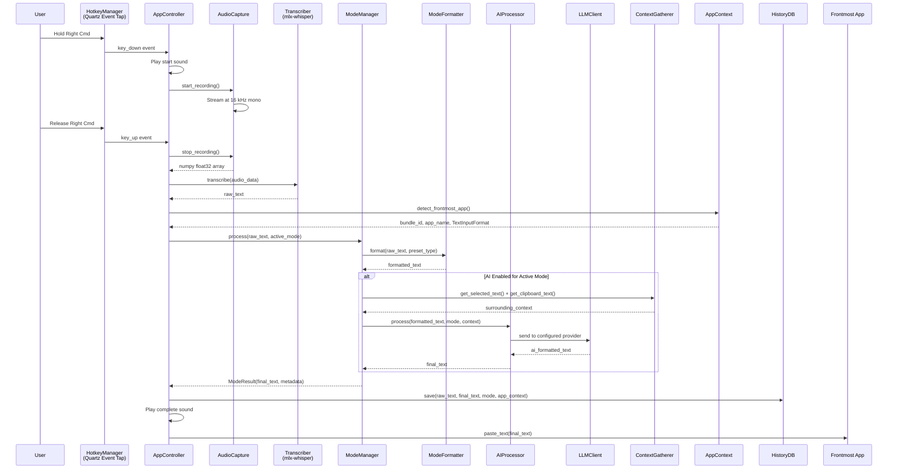
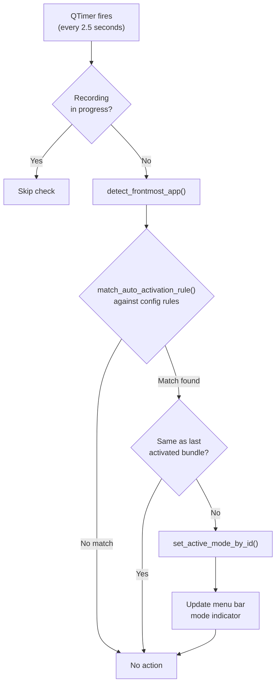
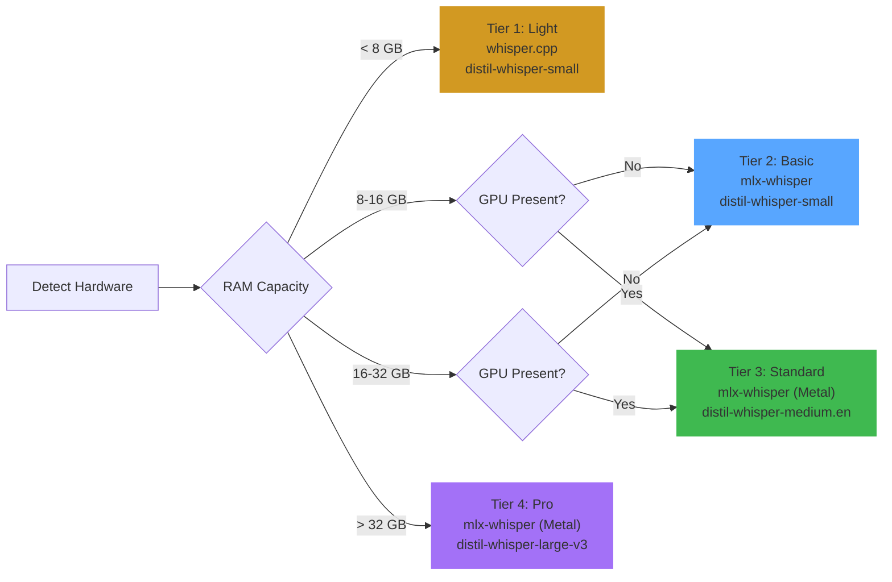

# Architecture — TommyTalker Pro

> System architecture for TommyTalker Pro, a privacy-first voice-to-text application for macOS.
> This document covers the system design, component relationships, data flow, and key technical decisions.

---

## System Context (C4 Level 1)

```mermaid
graph TB
    User["macOS User"]

    subgraph TTP["TommyTalker Pro"]
        App["Menu Bar Application<br/>(PyQt6)"]
    end

    Mic["Microphone<br/>(Audio Input)"]
    Cursor["Frontmost Application<br/>(Text Output)"]
    NSWorkspace["NSWorkspace API<br/>(App Detection)"]
    Quartz["Quartz Event Tap<br/>(Global Hotkeys)"]
    LLM["Cloud LLM Providers<br/>(Anthropic / OpenAI / Groq)"]
    Pyannote["pyannote.audio<br/>(Speaker Diarization)"]

    User -->|"Hold Right Cmd + Speak"| Mic
    Mic -->|"Audio Stream"| App
    App -->|"Paste Text"| Cursor
    NSWorkspace -->|"Bundle ID + App Name"| App
    Quartz -->|"Key Events"| App
    App -.->|"Optional: AI Formatting"| LLM
    LLM -.->|"Formatted Text"| App
    App -.->|"Optional: Speaker ID"| Pyannote

    style TTP fill:#1a1a2e,stroke:#58A6FF,stroke-width:2px
    style App fill:#0d1117,stroke:#58A6FF
    style LLM fill:#0d1117,stroke:#A371F7,stroke-dasharray:5
    style Pyannote fill:#0d1117,stroke:#A371F7,stroke-dasharray:5
```

**Boundaries:**
- All speech-to-text processing runs on-device via mlx-whisper (Apple Silicon Metal)
- Cloud LLM calls are optional, per-mode, and send only text (never audio)
- pyannote.audio runs locally but requires a HuggingFace token for model download
- No telemetry, no analytics, no data collection

---

## Container Architecture (C4 Level 2)

```mermaid
graph TB
    subgraph GUI["GUI Layer (PyQt6)"]
        MenuBar["Menu Bar App<br/>System tray + mode switcher"]
        Dashboard["Dashboard Window<br/>5-panel sidebar settings"]
        RecWin["Recording Windows<br/>Classic (waveform) + Mini"]
        Onboarding["Setup Guide +<br/>Onboarding Wizard"]
    end

    subgraph Controller["Orchestration Layer"]
        AppCtrl["AppController<br/>Central orchestrator"]
    end

    subgraph Engine["Engine Layer"]
        AudioCapture["AudioCapture<br/>Dual-stream recorder"]
        Transcriber["Transcriber<br/>mlx-whisper STT"]
        ModeManager["ModeManager<br/>Mode lifecycle + formatting"]
        AIProcessor["AIProcessor<br/>LLM post-processing"]
        LLMClient["LLMClient<br/>Provider abstraction"]
        Diarizer["Diarizer<br/>Speaker identification"]
        FileTranscriber["FileTranscriber<br/>External file processing"]
    end

    subgraph Utils["Infrastructure Layer"]
        HotkeyMgr["HotkeyManager<br/>Quartz Event Tap"]
        AppContext["AppContext<br/>97 app profiles"]
        HistoryDB["HistoryDB<br/>SQLite storage"]
        Config["Config<br/>JSON persistence"]
        HWDetect["HardwareDetect<br/>4-tier GPU-aware"]
        Credentials["SecureCredentials<br/>.env isolation"]
        Context["ContextGatherer<br/>Selection + clipboard"]
    end

    subgraph Data["Data Layer"]
        ConfigJSON["config.json"]
        HistorySQLite["history.db"]
        AppProfiles["app_profiles.json<br/>97 profiles"]
        Recordings["Recordings/<br/>WAV archives"]
    end

    MenuBar --> AppCtrl
    Dashboard --> AppCtrl
    RecWin --> AppCtrl
    AppCtrl --> AudioCapture
    AppCtrl --> ModeManager
    AppCtrl --> HistoryDB
    AppCtrl --> HotkeyMgr
    AppCtrl --> FileTranscriber
    ModeManager --> Transcriber
    ModeManager --> AIProcessor
    AIProcessor --> LLMClient
    AIProcessor --> Context
    ModeManager --> Diarizer
    AppCtrl --> AppContext
    AppContext --> AppProfiles
    Config --> ConfigJSON
    HistoryDB --> HistorySQLite
    AudioCapture --> Recordings
    LLMClient --> Credentials
    AppCtrl --> HWDetect

    style GUI fill:#1a1a2e,stroke:#58A6FF,stroke-width:2px
    style Controller fill:#1a1a2e,stroke:#A371F7,stroke-width:2px
    style Engine fill:#1a1a2e,stroke:#3FB950,stroke-width:2px
    style Utils fill:#1a1a2e,stroke:#D29922,stroke-width:2px
    style Data fill:#1a1a2e,stroke:#8B949E,stroke-width:2px
```

---

## Key Design Decisions

| Decision | Choice | Rationale | Alternatives Considered |
|----------|--------|-----------|------------------------|
| **STT Engine** | mlx-whisper on Metal | Native Apple Silicon acceleration, no server dependency, sub-second latency on M-series chips | whisper.cpp (C++, harder to integrate), faster-whisper (CUDA-focused), cloud STT APIs (privacy concern) |
| **Hotkey Mechanism** | Quartz Event Tap | Only macOS API that can intercept modifier-only keys (Right Command alone); works with Python 3.13+ | pynput (can't capture modifier-only), keyboard lib (requires sudo), CGEventTap wrappers (same underlying API but less control) |
| **Audio Pipeline** | Dual-stream (16 kHz + 44.1 kHz) | 16 kHz is Whisper's expected input — avoids resampling overhead; 44.1 kHz provides CD-quality archival in parallel | Single stream with post-hoc resampling (adds latency), 48 kHz unified (wastes memory for STT path) |
| **GUI Framework** | PyQt6 with LSUIElement | Menu bar app pattern (no Dock icon), native macOS feel, rich widget set for dashboard panels | SwiftUI (requires Xcode, can't share Python engine), Tkinter (limited widgets, no system tray), Electron (overkill, no Metal) |
| **LLM Integration** | Pluggable provider client | Users choose their provider and API key; no vendor lock-in; each mode can use a different provider | Ollama-only (requires local install, limits model choice), single provider (forces one API key) |
| **App Detection** | NSWorkspace + JSON profiles | Bundle ID matching is deterministic; 97 profiles cover major macOS apps; regex fallback handles unknown apps by category | Accessibility API (requires more permissions), window title parsing (fragile, locale-dependent) |
| **History Storage** | SQLite via stdlib | Zero dependencies, ACID-compliant, full-text search capable, automatic retention cleanup | JSON file (no search, grows unbounded), PostgreSQL (overkill for local app), Core Data (requires Objective-C bridge) |
| **Mode System** | 6 preset types with full per-mode config | Each use case (email, meeting, code) has different formatting needs and AI prompts; presets provide sensible defaults while allowing customization | Single global config (can't optimize per context), profile-based (too complex for 6 modes) |
| **Hardware Detection** | 4-tier with GPU probing | Metal (Apple Silicon) and CUDA (NVIDIA) detection ensures the right Whisper model and backend; prevents OOM on low-RAM machines | Manual selection (poor UX), single model (underutilizes capable hardware), runtime benchmarking (slow startup) |

---

## Data Flow — Push-to-Talk Pipeline

---

## Auto-Activation Flow

---

## Hardware Detection & Model Selection

GPU detection probes Metal via `system_profiler SPDisplaysDataType` on macOS and CUDA via `nvidia-smi` on Linux. The backend is selected accordingly: mlx-whisper for Metal, faster-whisper for CUDA, whisper.cpp as fallback.

---

## Security Posture

| Layer | Mechanism |
|-------|-----------|
| **Credentials** | API keys stored in `.env` file, loaded via `python-dotenv`, never committed (gitignored) |
| **Pre-Commit** | 9-phase security scanner checks for: API keys, hardcoded paths, PII patterns, internal references, sensitive files, database/binary files, dangerous code patterns, private assets, commercial markers |
| **Audio Privacy** | All STT runs on-device — raw audio never leaves the machine |
| **LLM Privacy** | Cloud LLM calls send only transcribed text (never audio); only active when user enables AI per mode and provides their own API key |
| **History** | Stored locally in `~/Documents/TommyTalker_Pro/history.db` with configurable retention (default 90 days, auto-cleanup) |
| **Filesystem** | Path guard utility enforces boundaries — prevents file operations outside designated directories |
| **Input Validation** | AST-based code validator + prompt injection detection for LLM inputs |

---

## Component Inventory

| Layer | Components | Count |
|-------|-----------|-------|
| **GUI** | MenuBarApp, DashboardWindow (5 panels), RecordingWindow, MiniRecordingWindow, SetupGuideWindow, OnboardingWizard, WaveformWidget | 10 |
| **Engine** | AudioCapture, SessionRecorder, Transcriber, ModeManager, CursorModeController, ModeFormatter, AIProcessor, LLMClient, Diarizer, FileTranscriber | 10 |
| **Utils** | HotkeyManager, AppContext, HistoryDB, Config, HardwareDetect, SecureCredentials, ContextGatherer, AudioFeedback, Logger, Permissions, PathGuard, CodeValidator, PromptInjectionDetector, Typing | 14 |
| **Data** | app_profiles.json (97 profiles), config.json, history.db, Recordings/ | 4 |
| **Total** | | **38 components** |

---

Copyright 2026 TJ Neary. All Rights Reserved.
