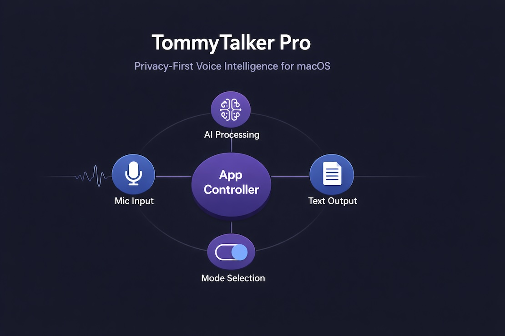

# TommyTalker Pro

**Privacy-first voice-to-text for macOS — local STT via mlx-whisper with app-aware formatting, AI post-processing, and push-to-talk dictation.**

TommyTalker Pro is the enhanced evolution of the open-source [TommyTalker](https://github.com/TJ-Neary/TommyTalker). It extends the core push-to-talk dictation engine with a multi-mode system, cloud LLM post-processing, transcription history, speaker diarization, file transcription, auto-activation rules, and a 5-panel sidebar dashboard. All speech recognition remains 100% on-device via mlx-whisper on Apple Silicon Metal — cloud APIs are used only for optional AI text formatting, and only when explicitly enabled per mode.

> **Note:** This is a showcase repository. It contains architecture documentation, design decisions, and technical specifications — not source code. The full implementation is maintained in a private repository. See [ARCHITECTURE.md](ARCHITECTURE.md) for the complete system design.

---

## What TommyTalker Pro Adds Over TommyTalker

TommyTalker provides the foundation: push-to-talk recording, local mlx-whisper transcription, app-aware formatting for 97 apps, and a menu bar interface. TommyTalker Pro builds on every layer of that architecture:

| Capability | TommyTalker (Base) | TommyTalker Pro |
|------------|-------------------|-----------------|
| **Operating Modes** | Single mode (voice-to-text) | 6 presets: Voice to Text, Message, Email, Note, Custom, Meeting |
| **AI Processing** | Engine-only (Ollama, not wired) | Per-mode LLM formatting via Claude, GPT, or Groq — context-aware with clipboard + selection |
| **Hardware Detection** | 3 tiers (RAM only) | 4 tiers with GPU awareness (Metal/CUDA detection) |
| **Recording UI** | None | Classic waveform (320x120) + mini compact (180x36), color-coded status |
| **History** | None | SQLite searchable history with date grouping, retention cleanup, per-record metadata |
| **Speaker Diarization** | Engine-only (not wired) | Wired into Meeting mode — pyannote.audio speaker identification |
| **File Transcription** | None | External audio/video transcription (MP3, MP4, WAV, M4A, FLAC, OGG, WEBM) |
| **Auto-Activation** | None | Rule-based automatic mode switching by frontmost app (2.5s polling) |
| **Word Replacements** | None | Custom STT correction rules for recurring misrecognitions |
| **Session Recording** | None | WAV archival of recording sessions at 44.1 kHz |
| **Dashboard** | 3-tab settings | 5-panel sidebar: Configuration, Modes, Sound, Vocabulary, History |
| **Menu Bar** | Basic controls | Mode switcher submenu, file transcription action, recording state with mode name |
| **Security** | Basic .gitignore | 9-phase pre-commit security scanner + .env credential isolation |
| **Test Coverage** | 76 tests | 356 tests across 13 files |

---

## Architecture Highlights

### Local-First ML Pipeline

Speech recognition runs entirely on-device through mlx-whisper, Apple's optimized ML framework for Apple Silicon. Audio is captured at 16 kHz mono via PortAudio (sounddevice), bypassing high-level audio APIs for low-latency push-to-talk performance. The 4-tier hardware detection system probes RAM capacity and GPU presence (Metal via `system_profiler`, CUDA via `nvidia-smi`) to select the appropriate Whisper model — from distil-whisper-small on 8GB machines to distil-whisper-large-v3 on 32GB+ systems with dedicated GPU.

### Multi-Mode AI Pipeline

Six operating modes (Voice to Text, Message, Email, Note, Custom, Meeting) each carry independent configuration: voice model, AI toggle, LLM provider, and custom prompt instructions. When AI is enabled for a mode, the pipeline gathers context — selected text and clipboard contents from the frontmost application — and sends the raw transcription plus context to the configured LLM (Anthropic Claude, OpenAI GPT, or Groq) for formatting. The LLM client abstracts provider differences behind a unified interface with per-provider configuration (API keys, base URLs, model selection).

### Quartz Event Tap Hotkey System

Global hotkeys use macOS Quartz Event Taps to intercept keyboard events at the system level — including modifier-only keys (Right Command) that standard hotkey libraries cannot capture. The event tap handles `flagsChanged` events for modifier keys and `keyDown`/`keyUp` events for standard combos (Option+R, Option+D), with a 500ms debounce to prevent rapid retrigger.

---

## Feature Table

| Feature | Technical Implementation | Business Value |
|---------|------------------------|----------------|
| Push-to-Talk Dictation | Quartz Event Tap + sounddevice PortAudio stream at 16 kHz | Hands-free text input without leaving the current application |
| App-Aware Formatting | NSWorkspace bundle ID detection, 97 JSON profiles with regex fallback | Text arrives correctly formatted — no manual cleanup |
| Multi-Mode System | 6 preset configurations with per-mode voice model + AI + prompt settings | One app handles email, notes, meetings, and code dictation |
| AI Post-Processing | Pluggable LLM client (Anthropic/OpenAI/Groq) with context injection | Raw speech becomes polished, professional text |
| Transcription History | SQLite with full-text search, date grouping, configurable retention | Searchable record of every dictation with one-click retrieval |
| Speaker Diarization | pyannote.audio pipeline integrated into Meeting mode | Meeting transcripts identify who said what |
| File Transcription | Format detection + pydub conversion → Whisper pipeline | Transcribe existing recordings without re-recording |
| Auto-Activation | QTimer polling at 2.5s + NSWorkspace app detection + rule matching | Mode switches automatically when switching between apps |
| Recording Windows | PyQt6 frameless overlays with real-time waveform (QPainter) | Visual recording feedback without obscuring the workspace |
| Hardware-Aware Models | psutil + Metal/CUDA probing → 4-tier model selection | Optimal performance on any Apple Silicon Mac |
| Session Archival | Parallel 44.1 kHz WAV capture alongside 16 kHz STT stream | Lossless recording backup for compliance or review |
| Security Pipeline | 9-phase bash scanner (secrets, PII, paths, patterns, commercial markers) | No credentials or sensitive data reach version control |

---

## Screenshots

> *Screenshots and demo recordings will be added in a future update.*

---

## Metrics

| Metric | Value |
|--------|-------|
| Test Coverage | 356 tests across 13 test files |
| App Profiles | 97 macOS applications with format detection |
| Operating Modes | 6 presets with full per-mode configuration |
| LLM Providers | 3 (Anthropic Claude, OpenAI GPT, Groq) |
| Hardware Tiers | 4 (Light, Basic, Standard, Pro) |
| Development Phases | 9 phases (11-19), each with PRD and TDD |
| STT Sample Rate | 16,000 Hz (Whisper-optimized mono) |
| Archival Sample Rate | 44,100 Hz (CD-quality WAV) |
| Hotkey Debounce | 500 ms |
| Auto-Activation Interval | 2,500 ms |
| Dashboard Panels | 5 (Configuration, Modes, Sound, Vocabulary, History) |

---

## Technology Stack

| Layer | Technology | Purpose |
|-------|------------|---------|
| Language | Python 3.12+ | Core application and engine |
| GUI Framework | PyQt6 | Menu bar, dashboard, recording windows, onboarding |
| Speech-to-Text | mlx-whisper (Metal) | On-device transcription on Apple Silicon |
| AI Processing | Anthropic SDK, OpenAI SDK, Groq SDK | Per-mode LLM text formatting |
| Audio Capture | sounddevice (PortAudio) + soundfile | Dual-stream recording (16 kHz STT + 44.1 kHz archival) |
| Speaker ID | pyannote.audio | Speaker diarization for meeting transcripts |
| History Storage | SQLite (via Python stdlib) | Searchable transcription history with retention |
| Hotkey System | Quartz Event Tap (pyobjc) | Modifier-only global hotkeys |
| App Detection | NSWorkspace (pyobjc-Cocoa) | Frontmost app identification for context + auto-activation |
| Text Insertion | pyautogui + pasteboard | Cursor-position text pasting |
| Hardware Detection | psutil + system_profiler + nvidia-smi | Cross-platform GPU-aware tier selection |
| Security | Custom 9-phase bash scanner | Pre-commit secret/PII/path detection |
| Packaging | PyInstaller | macOS .app bundle with LaunchAgent |

---

## System Design

See [ARCHITECTURE.md](ARCHITECTURE.md) for the complete system architecture including:

- C4 System Context and Container diagrams
- Push-to-talk data flow (record → transcribe → format → AI → paste)
- Key design decisions with rationale and alternatives considered
- Security posture and credential management approach
- Hardware detection and model selection logic

---

Copyright 2026 TJ Neary. All Rights Reserved.
